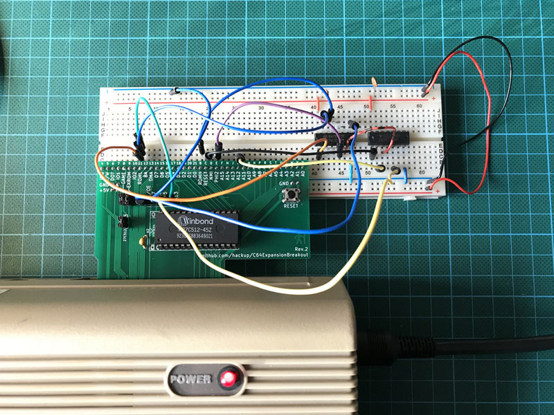
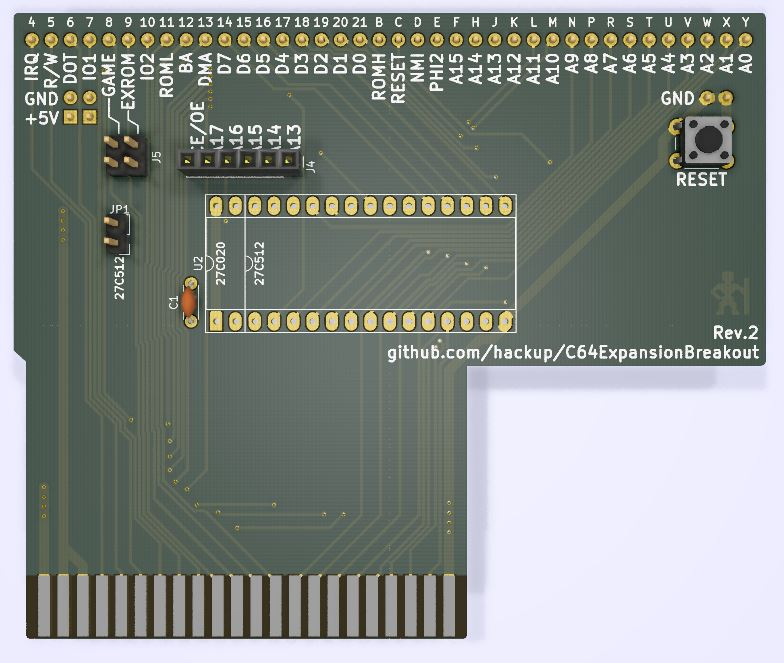
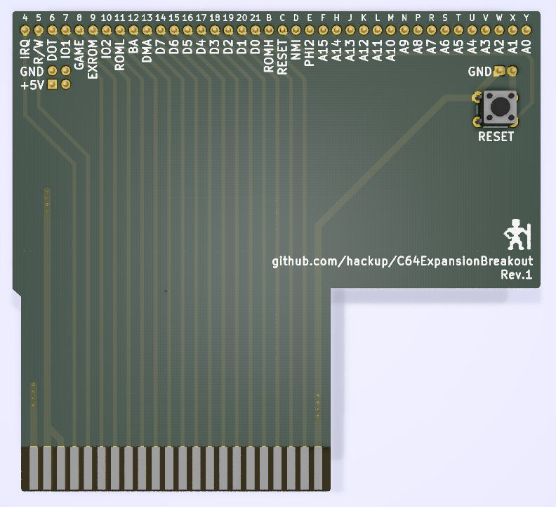

# C64ExpansionBreakout

This is an adapter board for the [expansion port](https://www.c64-wiki.com/wiki/Expansion_Port) of the Commodore 64. It connects the expansion port to a standard 830 pin prototyping breadboard to assist with the development of modules or cartridges. **USE AT YOUR OWN RISK!**

### Revision 2
This revision adds an optional on-board slot for either a 27c512 or 27c020 EPROM. The data bus lines D0-D7 and the address bus lines A0-A12 are connected directly to the slot, as are GND and the 5V power rail. The remaining address bus lines of the EPROM and CE/OE are available on J4. Jumper JP1 must be closed if a 27c512 chip is used.

### Revision 1
The first revision directly connects all 38 lines from the expansion port tho the breadboard. 5V and GND are connected to the matching rails on the breadboard. A reset button is added for convenience.

## License

This work is licensed under a
[Creative Commons Attribution-NonCommercial-ShareAlike 4.0 International License](http://creativecommons.org/licenses/by-nc-sa/4.0/).
